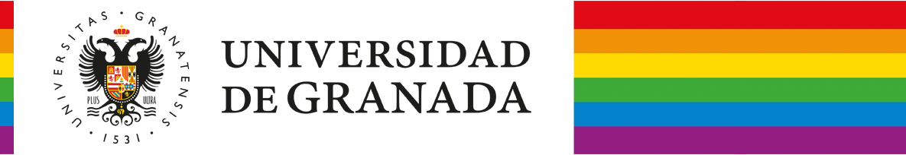

# Desigualdades Sociales en Andalucía

<p align="center">
  
</p>

[](https://doi.org/10.5281/zenodo.21237758)

Aplicación web interactiva (Shiny) para visualizar datos socioeconómicos y de renta de los hogares en Andalucía a nivel de sección censal (2015-2022). Incluye un Asistente Inteligente impulsado por IA que permite hacer preguntas sobre los datos en lenguaje natural, garantizando la máxima privacidad, ya que se ejecuta íntegramente de forma local.

**Autores:** Miguel Angel Luque Fernández, Gustavo Rivas Gervilla, Mario Rivera Izquierdo, Miguel Angel Montero Alonso y Juan Manuel Melchor Rodríguez (Doctores/Profesores de la UGR)

**Acceso en línea:** Puedes explorar la aplicación directamente en la web sin necesidad de instalación a través de [Shinyapps.io](https://watzile.shinyapps.io/RENTA/).

---

## Cómo ejecutar la aplicación en tu propio ordenador

### 1. Requisitos Previos (R y RStudio)
Necesitas tener instalados **R** y **RStudio** en tu equipo. Además, la primera vez que abras el proyecto, asegúrate de instalar las librerías necesarias ejecutando el siguiente código en la consola de RStudio:
```R
install.packages(c("shiny", "bslib", "leaflet", "dplyr", "sf", "stringr", "htmltools", "ellmer"))
```
*(Nota: la librería `querychat` puede requerir instalación desde GitHub si no se encuentra en CRAN).*

### 2. Configurar el Asistente Inteligente (Ollama)
Esta aplicación utiliza **Ollama** para que la inteligencia artificial procese tus preguntas de manera 100% local, sin enviar tus datos a la nube (garantizando tu privacidad).

Sigue estos pasos para configurarlo:
1. **Descarga e instala Ollama**: Ve a [https://ollama.com](https://ollama.com) y descarga el instalador para tu sistema operativo (Windows, Mac o Linux).
2. **Descarga el modelo de lenguaje**: Abre tu terminal (en Mac/Linux) o símbolo del sistema/PowerShell (en Windows) y ejecuta el siguiente comando para descargar el modelo necesario:
   ```bash
   ollama pull llama3.2
   ```
   *(Este proceso puede tardar unos minutos dependiendo de tu conexión a internet).*
3. **Mantén Ollama abierto**: Asegúrate de que la aplicación de Ollama se está ejecutando en segundo plano (verás el icono de una llama en tu barra de tareas o barra superior).

### 3. Ejecutar la Aplicación
1. Abre el archivo `app.R` en RStudio.
2. Haz clic en el botón **"Run App"** (situado en la parte superior del panel de código).
3. ¡Listo! Ya puedes explorar los mapas sociodemográficos y hacerle preguntas al asistente inteligente en la pestaña "Asistente IA".

---

## Cómo citar

Si usas esta aplicación en tu investigación, por favor cítala como:

> Luque Fernandez, M. A., Rivas Gervilla, G., Rivera Izquierdo, M., Montero Alonso, M. A., & Melchor Rodriguez, J. M. (2026). *Desigualdades Sociales en Andalucía* (v.1.0.0) [Software]. Zenodo. [https://doi.org/10.5281/zenodo.21237758](https://doi.org/10.5281/zenodo.21237758)

O en formato BibTeX:
```bibtex
@software{luque_fernandez_2026_21237758,
  author       = {Luque Fernandez, Miguel Angel and
                  Rivas Gervilla, Gustavo and
                  Rivera Izquierdo, Mario and
                  Montero Alonso, Miguel Angel and
                  Melchor Rodriguez, Juan Manuel},
  title        = {Desigualdades Sociales en Andalucía},
  version      = {v.1.0.0},
  year         = 2026,
  publisher    = {Zenodo},
  doi          = {10.5281/zenodo.21237758},
  url          = {https://doi.org/10.5281/zenodo.21237758},
}
```

---

## Licencia

Este proyecto se distribuye bajo la **Licencia MIT Educativa**, una variante de la licencia MIT estándar orientada a fines académicos y de investigación.

**¿Qué permite esta licencia?**
- Usar, copiar y modificar el software libremente con fines educativos, de investigación y docencia.
- Distribuir copias del software, siempre que se incluya el aviso de copyright y la licencia original.
- Usar el software con fines comerciales, siempre que no se limite su disponibilidad para fines educativos y de investigación.

**¿Qué exige esta licencia?**
- Mantener el aviso de copyright y este texto de licencia en todas las copias o partes sustanciales del software.
- Citar adecuadamente a los autores originales en cualquier publicación, presentación o trabajo derivado que utilice este software o sus resultados.

**Exención de responsabilidad:** El software se proporciona "tal cual", sin garantía de ningún tipo. Los autores no se hacen responsables de los daños derivados de su uso.

---

## Financiación


Este trabajo ha sido financiado por la **Universidad de Granada** en el marco del **Plan Propio de Investigación y Transferencia 2025**, específicamente bajo el **[Programa 21: Programa de Estimulación de la Investigación](https://investigacion.ugr.es/plan-propio/informacion/programas/p21)**.
